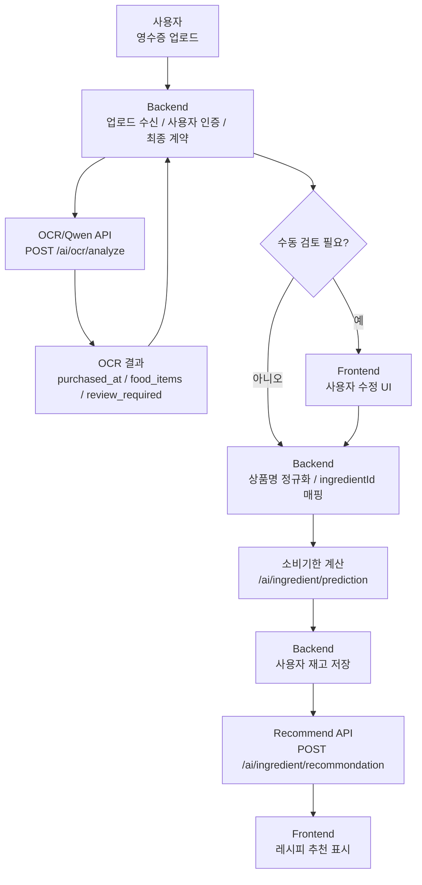
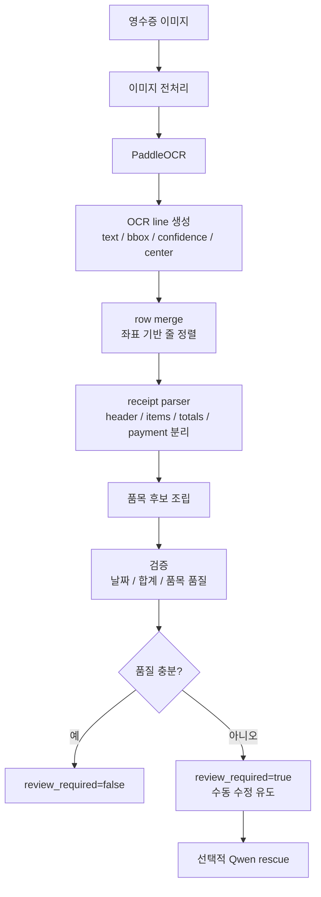

# AI Pipeline Q&A Guide

## 목적

이 문서는 물무물무 AI 폴더의 모델 구성, 처리 파이프라인, API 흐름, 운영 판단 기준을 질문 답변용으로 정리한다.

대상 독자:

- 백엔드/프론트 개발자
- API 관리자
- 발표나 질의응답을 준비하는 팀원
- GCP 배포/운영 담당자

기준 구현:

- [main.py](C:/Users/USER-PC/Desktop/jp/.cache/AI-Repository-fresh/main.py)
- [app_ocr.py](C:/Users/USER-PC/Desktop/jp/.cache/AI-Repository-fresh/app_ocr.py)
- [app_recommend.py](C:/Users/USER-PC/Desktop/jp/.cache/AI-Repository-fresh/app_recommend.py)
- [ingredient_prediction_service.py](C:/Users/USER-PC/Desktop/jp/.cache/AI-Repository-fresh/ingredient_prediction_service.py)
- [ocr_qwen/services.py](C:/Users/USER-PC/Desktop/jp/.cache/AI-Repository-fresh/ocr_qwen/services.py)
- [ocr_qwen/receipts.py](C:/Users/USER-PC/Desktop/jp/.cache/AI-Repository-fresh/ocr_qwen/receipts.py)
- [recommendation/vector_engine.py](C:/Users/USER-PC/Desktop/jp/.cache/AI-Repository-fresh/recommendation/vector_engine.py)

---

## 1. 한 줄 요약

Q. 현재 AI 폴더는 무엇을 하는가?

A. 영수증 이미지에서 식재료 후보를 추출하고, 소비기한을 예측하고, 보유 재료와 사용자 제약을 바탕으로 레시피를 추천하는 AI 보조 서비스다. 상품명 정규화와 `ingredientId` 확정은 백엔드 재료 DB 기준으로 처리한다.

Q. AI 서버가 제품의 최종 판단을 모두 책임지는가?

A. 아니다. AI 서버는 판단 보조 시스템이다. 최종 사용자 상태, 재고 저장, 권한, 응답 통합, 프론트 계약은 백엔드가 책임지는 구조가 맞다.

Q. 현재 서비스는 몇 개로 나뉘는가?

A. 두 개의 런타임 컨테이너로 나뉜다.

- OCR/Qwen 컨테이너: `app_ocr.py` -> `main.app`
- 추천 컨테이너: `app_recommend.py`

Q. GCP에는 어떻게 올라가 있는가?

A. OCR/Qwen API와 추천 API를 각각 별도 Cloud Run 서비스로 배포한다. Qwen GPU 실험은 Cloud Run이 아니라 별도 GPU VM에서 OpenAI-compatible endpoint로 붙이는 구조가 현재 방향이다.

---

## 2. 전체 처리 흐름

Q. 사용자가 영수증을 업로드하면 전체 흐름은 어떻게 되는가?

A. 제품 기준 흐름은 아래와 같다.



Q. 프론트가 AI API를 직접 호출해야 하는가?

A. 권장하지 않는다. 프론트는 백엔드 공개 API만 바라보는 것이 좋다. AI API는 내부 서비스로 두고, 백엔드가 AI 응답을 검증하고 프론트 계약에 맞게 변환해야 한다.

Q. 왜 백엔드를 중간에 둬야 하는가?

A. 이유는 네 가지다.

- 사용자 인증과 권한은 백엔드 책임이다.
- AI 결과는 실패하거나 흔들릴 수 있으므로 백엔드 검증이 필요하다.
- 프론트 계약이 AI 내부 변경에 흔들리지 않는다.
- AI 장애 시 fallback, 재시도, 수동 수정 전환을 백엔드에서 통제할 수 있다.

---

## 3. OCR/Qwen 파이프라인

Q. OCR 분석은 어떤 단계로 처리되는가?

A. 현재 OCR 파이프라인은 단순 텍스트 추출이 아니라 영수증 구조 복원까지 포함한다.



Q. OCR 메인 모델은 무엇인가?

A. PaddleOCR이 메인이다. 한글 영수증에서 bbox, confidence, 줄 단위 정보를 얻을 수 있고, rule-based parser와 결합하기 좋기 때문이다.

Q. Qwen은 어디에 쓰는가?

A. Qwen은 메인이 아니라 보조다. OCR-only 결과가 불안정하거나 일부 하드케이스에서 구조 보정이 필요할 때 rescue 역할로 붙인다.

Q. 왜 Qwen을 메인 OCR/파서로 쓰지 않는가?

A. 현재 제품 단계에서는 Qwen 단독 결과보다 OCR + rule parser가 더 통제 가능하다. Qwen은 결과가 그럴듯해 보여도 틀릴 수 있고, 작은 로컬 모델은 속도와 안정성이 부족하다. 식재료 등록은 틀리면 추천과 알림이 모두 흔들리므로, 실패를 숨기는 것보다 `review_required`로 수동 수정에 넘기는 편이 안전하다.

Q. `review_required`는 실패인가?

A. 아니다. 운영 안전장치다. 자동 등록해도 되는 케이스와 사용자가 확인해야 하는 케이스를 분리하기 위한 UX 신호다.

Q. OCR 응답의 핵심 필드는 무엇인가?

A. 현재 핵심은 아래다.

- `purchased_at`: 구매일
- `food_items`: 식품 후보 목록
- `food_items[].product_name`: 앱 저장/표시용 표준 식재료명 또는 미매핑 상품명
- `food_items[].raw_product_name`: 영수증 원문 상품명. 표준명과 다를 때 추적용으로 사용
- `food_items[].ingredientId`: AI 기준 표준 재료 ID. 매핑 실패 시 `null`일 수 있음
- `food_items[].ingredientName`: 표준 식재료명. 예: `서울우유 1L` -> `우유`
- `food_items[].mapping_status`: `MAPPED`이면 표준 식재료로 자동 선택 가능. 없거나 `null`이면 사용자가 확인해야 함
- `food_items[].category`: 8개 식품 카테고리 중 하나
- `food_items[].quantity`: 파싱된 구매 수량. 없으면 응답에서 생략될 수 있음
- `review_required`: 수동 검토 필요 여부
- `review_reasons`: 검토 사유
- `diagnostics`: 품질 판단 보조 정보

Q. 지원 카테고리는 무엇인가?

A. 현재 OCR 공개 응답 카테고리는 아래 8개로 고정한다.

- `정육/계란`
- `해산물`
- `채소/과일`
- `유제품`
- `쌀/면/빵`
- `소스/조미료/오일`
- `가공식품`
- `기타`

---

## 4. 상품명 정규화와 재료 매핑

Q. OCR에서 나온 상품명을 바로 추천에 쓰는가?

A. 아니다. OCR 상품명은 영수증 상품명이고, 추천은 표준 재료 ID 또는 재료명이 필요하다. 그래서 중간에 정규화와 재료 매핑 단계가 있다.

Q. 현재 이 매핑은 AI API가 담당하는가?

A. 일부 담당한다. OCR API는 `food_items` 안에 표준화 후보 메타데이터를 포함한다. 다만 사용자 재고 저장의 최종 기준은 백엔드 `Ingredient` DB이며, 프론트는 `MAPPED`가 아닌 항목을 그대로 저장하지 않고 표준 식재료 검색/선택으로 유도한다.

Q. 권장 처리 순서는 무엇인가?

A. 제품 기준 기본 순서는 아래다.

1. AI OCR이 원문 상품명을 추출한다.
2. AI가 alias/rule, DB exact/fuzzy match로 표준 식재료 후보를 찾는다.
3. `서울우유 1L`처럼 명확한 식재료 상품은 `product_name=우유`, `raw_product_name=서울우유 1L`, `mapping_status=MAPPED`로 내려간다.
4. `호가든캔330ml`, `아몬드초코볼`처럼 재고/추천 자동 확정이 위험한 항목은 원문명을 유지하고 `mapping_status`를 비워 사용자 확인 대상으로 둔다.
5. 프론트 수동 입력도 자유 저장하지 않고 백엔드 `/ingredient/search` 결과에서 표준 식재료를 선택해야 저장할 수 있다.
6. 백엔드는 최종 저장 시 `Ingredient` 마스터에 존재하는 이름만 `UserIngredient`로 저장한다.

Q. AI 폴더에 상품명 매칭 helper가 남아 있는 이유는 무엇인가?

A. OCR 결과를 앱 저장 가능한 표준 후보로 바꾸기 위한 내부 로직이다. 별도 공개 매칭 API는 제공하지 않고, `/ai/ocr/analyze` 응답의 `food_items` 메타데이터로만 노출한다.

Q. 프론트에서 사용자가 식재료를 직접 입력하면 어떻게 처리하는가?

A. 자유 텍스트를 그대로 저장하지 않는다. 사용자가 `서울우유`처럼 입력하면 백엔드 검색이 `우유` 같은 표준 후보를 반환하고, 사용자가 후보를 선택해야 저장 버튼이 통과한다. 이 정책 때문에 OCR 등록과 수동 등록이 같은 `Ingredient` 마스터 기준으로 유지된다.

Q. `서울우유`, `맛있는우유GT`처럼 표준명 문자열이 그대로 들어있지 않은 상품명은 어떻게 처리하는가?

A. 백엔드에 `IngredientAlias` 테이블을 둔다. alias는 `aliasName`, `normalizedAliasName`, `ingredientId`, `source`를 가진다. 검색은 표준 재료명 검색을 먼저 보고, alias 검색을 본 뒤, 마지막으로 역방향 포함 검색을 fallback으로 사용한다. 따라서 `맛있는우유GT`처럼 단순 contains만으로는 불안정한 상품명도 alias를 통해 `우유`로 안내할 수 있다.

Q. alias 사전은 왜 AI 파일에만 두지 않는가?

A. 최종 저장은 백엔드 `UserIngredient -> Ingredient` 관계로 이뤄지기 때문이다. AI의 `product_to_ingredient.json`은 OCR 후보 정규화에 쓰이고, 백엔드 `IngredientAlias`는 사용자 수동 입력과 최종 저장 직전 검색 UX를 책임진다. 두 사전은 같은 방향을 가져야 하며, 운영에서는 관리자 검수/사용자 수정 결과를 alias로 누적하는 방식이 필요하다.

Q. 관리자 OCR 검수 결과는 alias 사전에 반영되는가?

A. 반영된다. 관리자가 OCR 품목 수정 API에서 원문 상품명을 표준 식재료명으로 고치면, 백엔드는 기존 OCR 품목명과 수정된 표준 식재료명을 비교한다. 수정된 이름이 `Ingredient` 마스터에 존재하고, 기존 원문 alias가 아직 등록되어 있지 않으면 `source=ocr_admin_review`로 `IngredientAlias`에 저장한다. 예를 들어 `초이스엘우유팩 -> 우유`로 수정하면 이후 수동 검색에서도 `초이스엘우유팩` 입력 시 `우유`가 후보로 나온다.

Q. 왜 broad product mapping과 recommendation eligibility를 분리했는가?

A. 영수증에는 과자, 음료, 비식품, 행사 문구, 포장 단위가 섞인다. 백엔드 매핑 단계는 넓게 후보를 잡되, 추천 단계에서는 실제 레시피 재료로 쓸 수 있는 식재료만 사용하는 것이 맞다.

Q. 바코드로 구매 품목을 알아내는가?

A. 아니다. 현재 파이프라인은 바코드 기반 제품 식별을 전제로 하지 않는다. AI는 영수증 텍스트에서 상품명을 추출하고, 백엔드는 그 상품명을 재료 DB에 매핑한다.

---

## 5. 소비기한 예측

Q. 소비기한 예측은 어떤 API인가?

A. OCR/Qwen 컨테이너의 `/ai/ingredient/prediction`이 담당한다.

현재 노션 명세 기준 계약:

```json
{
  "purchaseDate": "2026-04-09",
  "ingredients": ["우유", "당근", "상추"]
}
```

응답:

```json
{
  "success": true,
  "result": {
    "purchaseDate": "2026-04-09",
    "ingredients": [
      {"ingredientName": "우유", "expirationDate": "2026-04-16"}
    ]
  }
}
```

Q. 내부적으로 어떤 모델을 쓰는가?

A. 우선 OpenAI `gpt-4o-mini`를 사용하고, 실패하면 rule-based fallback으로 내려간다.

Q. 왜 fallback이 필요한가?

A. OpenAI API 장애, 키 문제, 네트워크 문제, JSON 파싱 실패가 있어도 서비스 전체가 죽지 않아야 한다. 소비기한은 보수적인 기본값으로라도 반환하는 편이 사용자 흐름을 유지하기 쉽다.

Q. OpenAI API 키는 어디에 저장하는가?

A. 코드나 GitHub에 저장하지 않는다. 로컬은 `.env.local`, GCP는 Secret Manager의 `openai-api-key`를 Cloud Run 환경변수 `OPENAI_API_KEY`로 주입한다.

Q. 현재 주의할 점은 무엇인가?

A. 입력 검증은 더 강화해야 한다. 특히 빈 요청, 잘못된 날짜는 400 에러로 명확히 반환하는 것이 맞다. 현재 코드리뷰에서 이 부분은 개선 필요 항목으로 식별됐다.

---

## 6. 레시피 추천 파이프라인

Q. 추천은 별도 모델을 학습해서 쓰는가?

A. 현재는 별도 학습 모델이 아니라 벡터 기반 추천 엔진이다. 사용자 행동 로그가 충분하지 않기 때문에 지도학습 추천 모델을 만들기보다, 보유 재료와 레시피 재료의 거리/유사도 기반으로 추천한다.

Q. 그러면 AI 추천이라고 부를 수 있는가?

A. 넓은 의미에서는 AI 추천 시스템이지만, 딥러닝 학습 모델은 아니다. 현재는 rule + vector scoring 기반의 추천 엔진이다. 제품 초기 단계에서는 이 방식이 더 설명 가능하고 디버깅하기 쉽다.

Q. 추천 컨테이너의 API는 무엇인가?

A. 추천 컨테이너는 백엔드 계약에 맞춰 `POST /ai/ingredient/recommondation`을 공개한다. 경로의 `recommondation` 철자는 백엔드 명세와 맞추기 위해 그대로 둔다.

입력 핵심:

- `userIngredient.ingredients`
- `userIngredient.preferIngredients`
- `userIngredient.dispreferIngredients`
- `userIngredient.IngredientRatio`
- `candidates[].recipe_id`
- `candidates[].title`
- `candidates[].ingredients`

Q. 추천 후보는 어떻게 걸러지는가?

A. 기본 조건은 `matched / candidates[].ingredients.length >= userIngredient.IngredientRatio`다. 즉 레시피 재료를 모두 가지고 있거나, 기본값 기준 최소 절반 이상 가지고 있어야 추천 후보가 된다.

Q. 거리/벡터 기반 추천은 실제로 어떻게 동작하는가?

A. 백엔드가 넘긴 사용자 보유 재료명과 후보 레시피 재료명을 같은 문자열 재료 공간의 벡터로 본다. 예를 들어 사용자가 `양파`, `계란`, `밥`을 가지고 있고 어떤 후보 레시피가 `계란`, `밥`, `간장`, `참기름`을 필요로 하면, 겹치는 재료와 부족한 재료를 계산한 뒤 두 벡터가 얼마나 가까운지 점수화한다.

처리 순서는 아래와 같다.

1. 백엔드가 후보 레시피 목록을 `candidates`로 넘긴다.
2. 사용자 보유 재료명과 후보 레시피 재료명의 교집합을 구한다.
3. `coverageRatio = 보유 중인 후보 레시피 재료 수 / 후보 레시피 전체 재료 수`를 계산한다.
4. `coverageRatio`가 `IngredientRatio`보다 낮으면 후보에서 제외한다.
5. 비선호 재료가 제목 또는 재료에 포함되면 후보에서 제외한다.
6. 남은 후보에 대해 coverage ratio와 cosine similarity를 계산한다.
7. 선호 재료는 soft boost로 점수에 더한다.
8. 최종 `score`가 높은 순서로 정렬한다.

Q. 레시피 재료 벡터의 가중치는 어떻게 잡는가?

A. 새 백엔드 계약에서는 백엔드가 후보 레시피와 재료명을 직접 넘기므로, 추천 컨테이너는 후보 목록 안에서 단순하고 설명 가능한 문자열 벡터를 만든다. 현재 공개 API 점수는 보유 재료 매칭률을 가장 크게 보고, cosine similarity와 선호 재료 boost를 보조로 반영한다.

Q. cosine similarity는 여기서 어떤 의미인가?

A. 두 벡터의 방향이 얼마나 비슷한지 보는 값이다. 사용자 보유 재료 벡터가 레시피 재료 벡터와 같은 방향에 가까울수록 값이 커진다. 단순히 후보 재료 중 몇 개가 겹치는지만 보는 것보다, 사용자 재료 집합과 후보 레시피 재료 집합의 거리감을 함께 볼 수 있다.

예를 들어 후보 레시피가 `김치`, `밥`, `양파`, `스팸`을 필요로 하고 사용자가 `김치`, `양파`를 가지고 있으면 매칭률은 0.5이고, 이 후보는 기본 기준을 통과한다.

Q. 최종 점수는 어떤 식으로 합쳐지는가?

A. 현재 추천 점수는 아래 요소를 조합한다.

```text
score =
  0.75 * coverageRatio
+ 0.17 * cosineSimilarity
+ preferenceBonus
```

점수는 마지막에 `0.0`에서 `1.0` 사이로 제한한다. 이 구조 때문에 “재료를 절반 이상 가지고 있는가”로 후보를 먼저 좁히고, 그 안에서 “벡터가 얼마나 가까운가”, “선호 재료가 포함되는가”로 순위를 정한다.

Q. 알레르기나 비선호 재료는 어떻게 처리되는가?

A. hard filter다. 해당 재료가 레시피에 포함되면 점수를 낮추는 것이 아니라 후보에서 제거한다.

Q. 선호 재료나 선호 카테고리는 어떻게 처리되는가?

A. soft boost다. 후보에서 제거하거나 무조건 1등으로 올리는 것이 아니라 점수에 가산한다.

Q. 추천 점수는 무엇으로 계산되는가?

A. 주요 요소는 아래다.

- 보유 재료 비율 `coverageRatio`
- 가중 재료 충족률 `weightedCoverage`
- 핵심 재료 충족률 `coreCoverage`
- cosine similarity
- 부족 재료 penalty
- 선호 조건 bonus

Q. 왜 거리/벡터 기반인가?

A. 현재 요구사항이 “내가 가진 재료와 레시피 재료가 얼마나 가까운가”에 가깝기 때문이다. 사용자 행동 로그가 없는 상태에서 학습 모델을 억지로 만들면 품질을 검증하기 어렵다. 반면 벡터 기반은 재료 일치율과 부족 재료를 직접 설명할 수 있다.

---

## 7. 컨테이너와 배포 구조

Q. 왜 컨테이너를 두 개로 나눴는가?

A. OCR과 추천은 성격이 다르기 때문이다.

- OCR/Qwen: 이미지 처리, OCR, OpenAI 소비기한, Qwen rescue
- 추천: DB 레시피 로딩, 벡터 점수화, 개인화 필터

분리하면 배포, 장애 영향, 스케일링, 비용 관리가 쉬워진다.

Q. 현재 로컬 개발 실행은 어떻게 하는가?

A. Docker Compose 기준:

```powershell
docker compose up --build ocr-api
docker compose up --build recommend-api
```

직접 실행 기준:

```powershell
uvicorn app_ocr:app --host 0.0.0.0 --port 8000 --reload
uvicorn app_recommend:app --host 0.0.0.0 --port 8002 --reload
```

Q. GCP에서는 어떤 구조인가?

A. 현재 권장 구조는 아래다.

- `mulmumu-ocr-api`: Cloud Run, OCR/Qwen API
- `mulmumu-recommend-api`: Cloud Run, 추천 API
- Qwen GPU 실험: 별도 Compute Engine GPU VM
- 이미지 저장소: Artifact Registry `mulmumu-ai`

Q. 왜 Qwen GPU를 Cloud Run에 직접 붙이지 않는가?

A. 비용과 운영 복잡도 때문이다. Qwen은 현재 메인 경로가 아니라 hard-case rescue 보조이므로, GPU는 별도 VM에서 실험/교체 가능하게 두는 것이 더 합리적이다.

---

## 8. 백엔드와의 연결 기준

Q. 백엔드 공개 API와 AI 내부 API는 같은가?

A. 같지 않다. 백엔드 공개 API는 프론트 계약이고, AI 내부 API는 백엔드가 호출하는 내부 서비스 계약이다.

Q. 백엔드가 호출해야 하는 AI 내부 API는 무엇인가?

A. 현재 기준은 아래다.

- OCR 분석: OCR 서비스 `POST /ai/ocr/analyze`
- 소비기한 계산: OCR 서비스 `GET`/`POST /ai/ingredient/prediction`
- 레시피 추천: 추천 서비스 `POST /ai/ingredient/recommondation`

상품명 정규화와 `ingredientId` 매핑은 AI 호출이 아니라 백엔드 내부 처리다.

Q. 현재 가장 큰 통합 리스크는 무엇인가?

A. 백엔드 공개 API가 아직 배포된 AI 서비스를 호출하지 않는 점이다. 백엔드에 adapter가 붙어야 실제 사용자 경로에서 OCR, OpenAI 소비기한, 벡터 추천을 사용할 수 있다.

Q. 백엔드 adapter는 어떤 역할을 해야 하는가?

A. 역할은 아래다.

- 프론트 요청을 받아 AI 내부 API 형식으로 변환
- AI 응답을 백엔드 DTO와 노션 API 명세에 맞게 변환
- 실패 시 fallback 또는 수동 수정 흐름으로 전환
- timeout/retry/error code를 통제
- 사용자 ID, 재고 저장, 추천 결과 저장 등 비즈니스 책임 유지

---

## 9. 품질 관리와 테스트

Q. 현재 어떤 테스트가 있는가?

A. 주요 테스트 범위는 아래다.

- OCR API 계약 테스트
- OCR rule parser 테스트
- 영수증 품질 rule 테스트
- silver/synthetic receipt dataset 테스트
- 추천 엔진 테스트
- 추천 품질 케이스 테스트
- Docker Compose surface 테스트
- API surface 테스트

Q. 현재 전체 테스트 상태는 어떤가?

A. 최근 기준 전체 테스트는 `212 passed, 5 warnings`다.

Q. warnings는 무엇인가?

A. 주로 FastAPI `@app.on_event` deprecation과 `python_multipart` import 경고다. 기능 실패는 아니지만, 추후 lifespan handler로 정리하는 것이 좋다.

Q. 품질 평가는 어떤 방향인가?

A. OCR은 “정답률 100%”보다 자동 등록 가능한 케이스와 수동 수정이 필요한 케이스를 잘 구분하는 것이 중요하다. 추천은 품질 케이스 JSON을 기준으로 top1/top3/exclusion 조건을 검증한다.

Q. OCR 성능지표는 어디에 문서화되어 있는가?

A. 현재 OCR 성능지표는 아래 문서에 정리되어 있다.

- [docs/datasets/OCR_QUALITY_BASELINE.md](C:/Users/USER-PC/Desktop/jp/.cache/AI-Repository-fresh/docs/datasets/OCR_QUALITY_BASELINE.md)
- [docs/datasets/RECEIPT_SILVERSET.md](C:/Users/USER-PC/Desktop/jp/.cache/AI-Repository-fresh/docs/datasets/RECEIPT_SILVERSET.md)
- [docs/history/baselines/RECEIPT_GOLDSET_BASELINE_2026-04-21.md](C:/Users/USER-PC/Desktop/jp/.cache/AI-Repository-fresh/docs/history/baselines/RECEIPT_GOLDSET_BASELINE_2026-04-21.md)

Q. OCR 평가는 어떤 데이터셋으로 하는가?

A. 두 축으로 나눠 본다.

- `gold set`: 사람이 검수하거나 수작업 보정한 기준셋이다. 실제 품질 설명에는 이 값을 쓴다.
- `silver set`: 현재 엔진 출력으로 만든 회귀 기준셋이다. parser를 바꿨을 때 기존 동작이 깨졌는지 확인하는 용도다.

Q. silver set 점수 1.0은 OCR이 완벽하다는 뜻인가?

A. 아니다. silver set는 현재 엔진 출력과 baseline이 다시 일치하는지 보는 자기 비교 성격이 강하다. 따라서 `1.0`은 “현재 기준선과 동일하게 동작한다”는 뜻이지, 실제 OCR 절대 정확도가 100%라는 뜻이 아니다.

Q. 실제 성능 설명에는 어떤 수치를 쓰는가?

A. 현재는 `jevi-gold-v0` 기준선을 쓴다. 최근 문서화된 기준선은 아래다.

| 지표 | 값 |
|---|---:|
| image_count | 17 |
| vendor_name_accuracy | 1.0 |
| purchased_at_accuracy | 0.9412 |
| payment_amount_accuracy | 1.0 |
| item_name_f1_avg | 0.9938 |
| quantity_match_rate_avg | 0.9882 |
| amount_match_rate_avg | 0.9686 |
| review_required_accuracy | 1.0 |

Q. 각 OCR 지표는 무엇을 의미하는가?

A. 의미는 아래와 같다.

- `vendor_name_accuracy`: 매장명 추출 일치율
- `purchased_at_accuracy`: 구매일 추출 일치율
- `payment_amount_accuracy`: 결제금액 추출 일치율
- `item_name_precision_avg`: 추출한 품목명 중 정답 품목 비율
- `item_name_recall_avg`: 정답 품목 중 실제로 추출한 비율
- `item_name_f1_avg`: 품목명 precision/recall의 조화평균
- `quantity_match_rate_avg`: 정답 품목의 수량 일치율
- `amount_match_rate_avg`: 정답 품목의 금액 일치율
- `review_required_accuracy`: 수동 검토 필요 여부 판단 일치율

Q. OCR 품질 평가는 어떻게 실행하는가?

A. gold/silver manifest를 대상으로 평가 스크립트를 실행한다.

```powershell
python scripts/evaluate_receipt_silver_set.py --manifest data/receipt_gold/jevi-gold-v0/manifest.json
```

합성 영수증 데이터셋은 아래 스크립트로 평가한다.

```powershell
python scripts/evaluate_synthetic_receipts.py --manifest data/receipt_synthetic/receipt-synthetic-v1/manifest.json
```

Q. OCR 성능에서 현재 남은 약점은 무엇인가?

A. 문서화된 약점은 아래다.

- 일부 crop/date 누락 케이스
- OCR line 자체가 붕괴한 품목명 hard-case
- low-resolution 영수증의 상품명 collapse
- alias/정규화 사전이 부족한 상품명
- 총액 mismatch를 유발하는 할인/쿠폰/비식품 footer noise

Q. OCR 성능을 발표할 때 주의할 점은 무엇인가?

A. `gold set` 지표와 `silver set` 지표를 섞어서 말하면 안 된다. 발표나 외부 설명에는 `gold set`의 실제 품질 지표를 쓰고, `silver set`은 “회귀 테스트용 기준선”이라고 설명해야 한다.

---

## 10. 자주 나오는 질문

Q. 이 프로젝트는 OCR 프로젝트인가?

A. 단순 OCR 프로젝트가 아니다. 영수증 OCR을 시작점으로 재료 등록, 소비기한 계산, 레시피 추천까지 이어지는 식재료 관리 파이프라인이다.

Q. 왜 모든 것을 딥러닝 모델로 하지 않았는가?

A. 현재 데이터가 부족하고, 영수증/추천은 설명 가능성과 디버깅 가능성이 중요하다. 그래서 OCR은 PaddleOCR, 구조 해석은 rule parser, 추천은 vector scoring, Qwen/OpenAI는 보조로 두는 구성이 현실적이다.

Q. 추천 모델은 나중에 학습 모델로 바꿀 수 있는가?

A. 가능하다. 사용자의 클릭, 저장, 조리, 선호/비선호, 알레르기, 실제 재고 소진 로그가 쌓이면 learning-to-rank나 embedding model로 확장할 수 있다. 지금은 그 전 단계다.

Q. 프론트에서 가장 중요한 UX는 무엇인가?

A. OCR 결과 검토/수정 UX다. AI가 항상 맞는다는 가정이 아니라, 자동 처리 가능한 케이스와 사람이 확인해야 하는 케이스를 분리해야 한다.

Q. 운영에서 가장 먼저 봐야 할 지표는 무엇인가?

A. 아래 지표가 중요하다.

- OCR 성공률
- `review_required` 비율
- 백엔드 상품명 정규화/매핑 성공률 `MAPPED / UNMAPPED / EXCLUDED`
- 소비기한 fallback 비율
- 추천 응답 시간
- 추천 결과 클릭/저장률

Q. 현재 다음 작업 우선순위는 무엇인가?

A. 우선순위는 아래다.

1. 백엔드 adapter를 붙여 실제 제품 경로에서 AI Cloud Run을 호출하게 만들기
2. 유통기한 API 입력 검증 강화
3. FastAPI validation error envelope 통일
4. 프론트 OCR 검토/수정 UX 연결
5. 추천 결과에 사용자 행동 로그를 쌓아 차기 개인화 모델 기반 마련

---

## 11. 발표/리뷰용 핵심 답변

Q. “AI 모델을 뭘 썼나요?”

A. OCR은 PaddleOCR을 메인으로 사용하고, Qwen은 hard-case 보조로 둡니다. 소비기한은 OpenAI `gpt-4o-mini`를 사용하되 실패하면 rule-based fallback으로 처리합니다. 추천은 학습 모델이 아니라 재료 벡터 기반 추천 엔진입니다.

Q. “왜 추천에 딥러닝 모델을 안 썼나요?”

A. 현재는 사용자 행동 로그가 부족해서 학습 모델을 만들 정답 데이터가 없습니다. 대신 보유 재료와 레시피 재료의 유사도, 핵심 재료 충족률, 부족 재료 penalty, 알레르기 hard filter를 명확히 반영하는 벡터 기반 방식이 더 검증 가능하고 제품 요구사항에 맞습니다.

Q. “OCR 결과가 틀리면 어떻게 하나요?”

A. `review_required`와 `review_reasons`로 프론트 수동 수정 흐름에 넘깁니다. 틀린 값을 자동 저장하는 것보다 사용자가 확인하도록 만드는 것이 재고/추천 품질 측면에서 안전합니다.

Q. “Qwen은 왜 GPU에서 따로 돌리나요?”

A. Qwen은 메인 파서가 아니라 rescue 보조입니다. 전체 API를 GPU에 묶으면 비용과 운영 부담이 커지므로, OCR/추천은 Cloud Run CPU로 운영하고 Qwen은 필요 시 GPU VM의 외부 provider로 붙이는 구조가 맞습니다.

Q. “현재 완성도에서 가장 큰 빈틈은 무엇인가요?”

A. AI 서비스 자체는 배포되어 있지만, 백엔드 공개 API가 아직 AI 서비스를 실제 호출하지 않는 것이 가장 큰 통합 빈틈입니다. 백엔드 adapter를 붙이면 제품 플로우가 완성됩니다.
