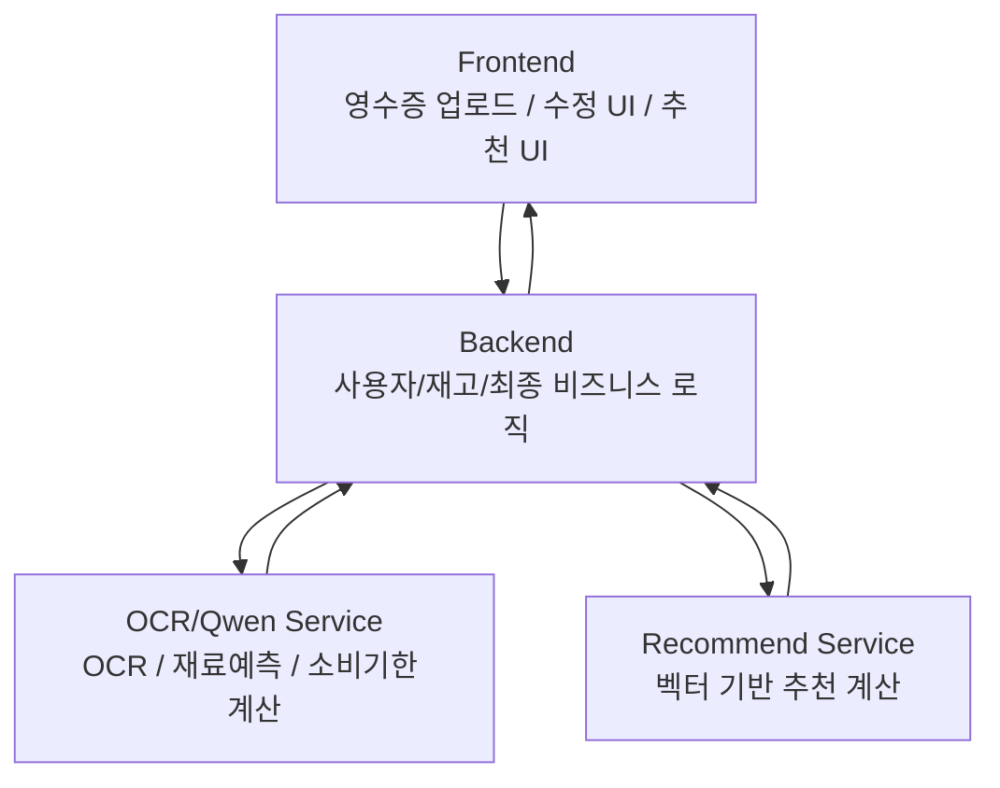
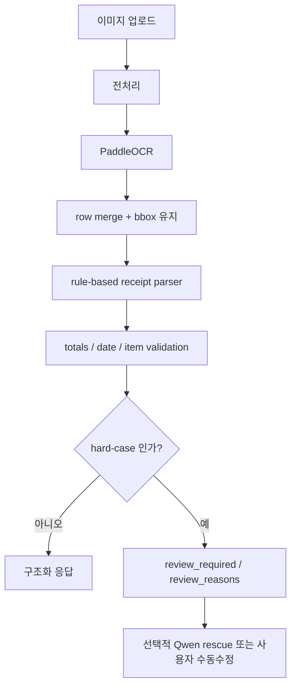

# Project Process And Rationale

## 목적

이 문서는 현재 프로젝트가 어떤 제품 범위를 전제로 동작하는지,  
사용자 입장에서 어떤 흐름으로 기능이 이어지는지,  
개발자 입장에서 프론트-백엔드-AI가 어떤 역할로 분리되어 있는지,  
그리고 왜 현재 기술 구성을 이렇게 잡았는지를 정리한다.

기준 저장소:

- [main.py](C:/Users/USER-PC/Desktop/jp/.cache/AI-Repository-fresh/main.py)
- [app_recommend.py](C:/Users/USER-PC/Desktop/jp/.cache/AI-Repository-fresh/app_recommend.py)
- [ocr_qwen/services.py](C:/Users/USER-PC/Desktop/jp/.cache/AI-Repository-fresh/ocr_qwen/services.py)
- [ocr_qwen/receipts.py](C:/Users/USER-PC/Desktop/jp/.cache/AI-Repository-fresh/ocr_qwen/receipts.py)
- [vector_engine.py](C:/Users/USER-PC/Desktop/jp/.cache/AI-Repository-fresh/recommendation/vector_engine.py)

---

## 1. 제품 범위

현재 프로젝트의 우선순위는 **식재료 영수증 처리**다.

우선 지원 범위:

- 마트 영수증
- 편의점 영수증
- 식자재마트 영수증
- 정육점, 베이커리 등 식품 중심 영수증

보조 처리 범위:

- 식품과 비식품이 섞인 혼합 영수증

범위 밖:

- 약국 영수증
- 전자제품 영수증
- 일반 생활잡화 중심 영수증

이 정책은 현재 응답의 `scope_classification`으로 반영된다.

- `food_scope`
- `mixed_scope`
- `out_of_scope`

즉, 이 프로젝트는 “모든 영수증 OCR”이 아니라  
**식재료 등록과 레시피 추천으로 이어질 수 있는 영수증을 우선 처리하는 제품**이다.

---

## 2. 사용자 관점의 처리 흐름

### 2-1. 정상 자동 처리 흐름

1. 사용자가 영수증 사진을 업로드한다.
2. AI 서버가 영수증을 분석해 품목, 수량, 구매일, 합계를 추출한다.
3. 추출 결과가 충분히 안정적이면 `review_required=false`로 반환한다.
4. 사용자는 자동 추출 결과를 확인하고 그대로 등록한다.
5. 등록된 품목은 재료 단위로 매핑된다.
6. 사용자의 선호/비선호/알레르기와 결합해 레시피 추천이 제공된다.

### 2-2. 수동 수정 흐름

1. 영수증 분석 결과가 불안정하거나 제품 범위를 벗어나면 `review_required=true`로 반환된다.
2. 프론트는 자동 등록 대신 수정 화면을 띄운다.
3. 사용자는 품목명, 수량, 날짜를 직접 수정한다.
4. 수정 후 확정된 값으로 재료 매핑과 추천을 이어간다.

현재 프로젝트 기준으로 이 흐름이 가장 중요하다.  
하드케이스를 백엔드에서 끝까지 억지 복구하려고 하기보다,  
**안정적인 경우는 자동 처리하고 애매한 경우는 사용자 수정으로 넘기는 방식**이 제품적으로 더 건강하다.

### 2-3. 추천 사용 흐름

사용자는 단순히 “보유 재료 기반 추천”만 받는 것이 아니라,  
아래 입력을 같이 줄 수 있다.

- 선호 재료
- 비선호 재료
- 알레르기 재료
- 선호 카테고리
- 제외 카테고리
- 선호 키워드
- 제외 키워드

즉 추천은 단순 정적 목록이 아니라  
**현재 냉장고 상태 + 사용자 취향/제약**을 함께 반영하는 구조다.

---

## 3. 개발자 관점의 시스템 흐름

핵심 원칙:

- 프론트는 AI 서버를 직접 호출하지 않는다.
- 백엔드가 최종 비즈니스 책임을 가진다.
- AI 서버는 **판단 보조 시스템**이다.

이렇게 분리하는 이유:

- 프론트는 응답 계약을 백엔드 하나만 보면 된다.
- AI 결과가 바뀌어도 백엔드에서 검증/보정할 수 있다.
- 운영 시 장애와 책임 구분이 명확해진다.

---

## 4. AI 서버 내부 처리 흐름

### 4-1. OCR 분석

실제 처리 흐름은 아래와 같다.

관련 구현 위치:

- [ocr_qwen/preprocess.py](C:/Users/USER-PC/Desktop/jp/.cache/AI-Repository-fresh/ocr_qwen/preprocess.py)
- [ocr_qwen/services.py](C:/Users/USER-PC/Desktop/jp/.cache/AI-Repository-fresh/ocr_qwen/services.py)
- [ocr_qwen/receipts.py](C:/Users/USER-PC/Desktop/jp/.cache/AI-Repository-fresh/ocr_qwen/receipts.py)

### 4-2. 재료 예측

OCR 결과의 상품명은 그대로 추천에 쓰지 않는다.

1. 상품명 alias 정규화
2. 규칙 사전 매핑
3. DB exact match
4. DB fuzzy match
5. `MAPPED / UNMAPPED / EXCLUDED` 분류

즉, **상품명 -> 재료** 변환 단계를 분리해서 운영한다.

### 4-3. 추천

추천은 현재 별도 추천 컨테이너에서 동작한다.

1. 보유 재료 입력
2. 추천 가능한 재료 집합 필터링
3. 하드 필터 적용
   - 알레르기
   - 비선호 재료
   - 제외 카테고리
   - 제외 키워드
4. 기본 필터
   - `coverageRatio >= 0.5`
   - 즉 레시피 재료를 모두 가지고 있거나 절반 이상 가지고 있어야 후보
5. 기본 점수 계산
   - cosine similarity
   - 재료 벡터 유사도 기반 정렬
6. 선호 조건 boost
   - 선호 재료
   - 선호 카테고리
   - 선호 키워드
7. 최종 정렬

관련 구현:

- [app_recommend.py](C:/Users/USER-PC/Desktop/jp/.cache/AI-Repository-fresh/app_recommend.py)
- [vector_engine.py](C:/Users/USER-PC/Desktop/jp/.cache/AI-Repository-fresh/recommendation/vector_engine.py)

---

## 5. 왜 이렇게 구성했는가

### 5-1. 왜 PaddleOCR이 메인인가

현재 OCR 메인은 PaddleOCR이다.

이유:

- 한글 영수증 처리 성능이 현재 구조에서 가장 현실적이다.
- bbox와 confidence를 함께 사용할 수 있다.
- 후속 rule parser와 조합하기 좋다.
- 응답 속도와 디버깅 가능성이 좋다.

즉, 지금 목표에선 “OCR 텍스트 추출 안정성”이 가장 중요하고,  
그 기준에서 PaddleOCR이 가장 실용적이었다.

### 5-2. 왜 rule-based parser가 메인인가

현재 품목 조립과 합계 검증은 rule-based다.

이유:

- 영수증 구조 오류를 추적하기 쉽다.
- 테스트로 고정하기 쉽다.
- 특정 패턴이 깨졌을 때 어디서 실패했는지 명확하다.
- 비용이 적고 응답이 안정적이다.

즉, 현재 단계에서는 “모델이 똑똑하게 다 해석한다”보다  
**구조를 코드로 통제하는 편이 더 낫다.**

### 5-3. 왜 Qwen은 보조인가

Qwen은 현재 메인 파서가 아니다.

이유:

- local small Qwen은 hard-case rescue에 느리고 불안정했다.
- 잘못된 rescue를 그대로 받으면 오히려 품질이 악화된다.
- 제품 흐름상 애매한 케이스는 수동 수정으로 넘기는 편이 더 낫다.

그래서 현재 정책은:

- 메인: OCR + rule parser
- 보조: 제한적 rescue
- 실패 시: fallback 또는 review

즉 Qwen은 “없으면 안 되는 핵심”이 아니라  
**있으면 일부 하드케이스를 도와주는 선택 기능**으로 남겨둔 상태다.

### 5-4. 왜 추천은 벡터 기반인가

현재 추천은 따로 학습한 ML 모델이 아니라  
**벡터 유사도 기반 추천 엔진**이다.

이유:

- 사용자 행동 로그가 아직 없다.
- 클릭/저장/조리/평점 데이터가 없다.
- 지도학습 추천 모델을 학습할 정답 데이터가 부족하다.
- 대신 “재료를 절반 이상 가지고 있으면 추천”이라는 요구는 벡터/거리 기반으로 직접 반영하기 쉽다.

즉 지금 단계에서 중요한 것은 “학습 모델을 쓰는가”가 아니라  
**보유 재료 비율과 사용자 제약을 안정적으로 반영하는가**다.

### 5-5. 왜 review 흐름을 남겼는가

이 프로젝트는 100% 자동화보다  
**실패를 숨기지 않고 사용자에게 수정 기회를 주는 구조**를 선택했다.

이유:

- 식재료 등록은 틀리면 후속 추천이 다 흔들린다.
- 하드케이스를 억지 복구하는 것보다 사용자 수정이 더 안전하다.
- 프론트에서 수정 UX를 붙이면 실제 운영 가능성이 높아진다.

즉 `review_required`는 실패가 아니라  
**제품 품질을 지키기 위한 명시적 분기**다.

---

## 6. 현재 남은 일

현재 코드 기준으로 새 핵심 기능을 더 만드는 것보다 아래 작업이 중요하다.

### 제품/프론트

- 수동 수정 화면 구현
- `scope_classification`에 따른 안내 문구와 분기 UX
- 자동 등록 / 수정 후 등록 플로우 정리

### 백엔드/AI

- 한국 식재료 실사 gold set 확대
- stale 문서 정리
- 더 큰 provider가 있을 때만 Qwen rescue 재실험

### 협업

- 프론트는 백엔드만 호출
- 백엔드는 AI 서버를 감싸는 최종 책임 계층
- AI 서버 응답 계약은 문서와 코드 기준을 계속 맞춰야 함

---

## 7. 현재 단계 판단

현재 프로젝트는 다음 단계에 와 있다.

- OCR / 재료 예측 / 개인화 추천: 구현 완료에 가까움
- 제품 범위 정책: 정리됨
- review 정책: 정리됨
- 남은 핵심: 프론트 연결과 실사 검증 확대

즉 지금은 “무엇을 더 만들까”보다  
**어떻게 사용자 경험으로 완성할까**가 더 중요한 단계다.
